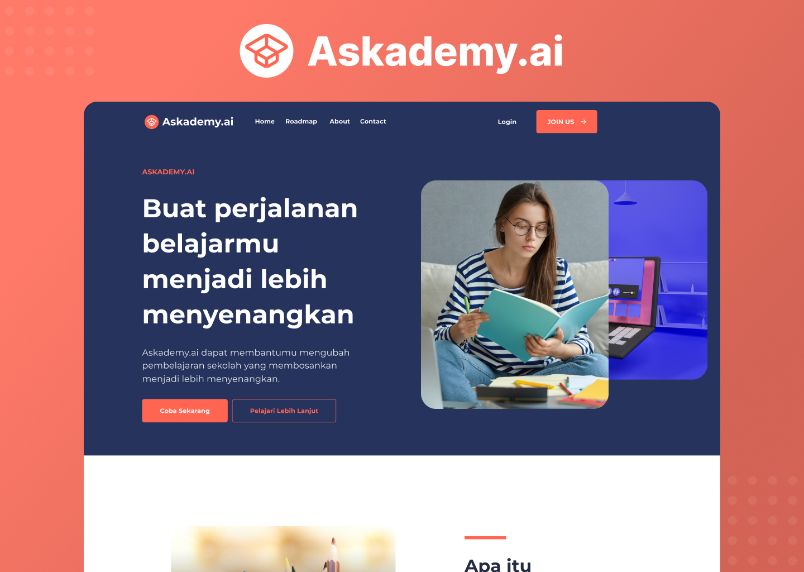
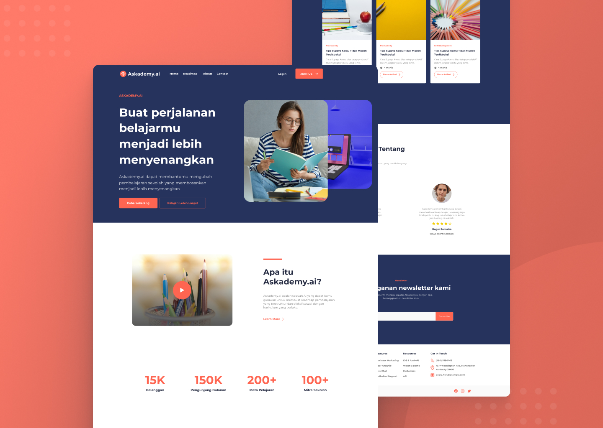

<h1 align="center">Askademy.ai</h1>



<p align="center">Askademy.ai adalah sebuah AI yang dapat kamu gunakan untuk membuat roadmap pembelajaran yang terstruktur dan efektif sesuai dengan kurikulum yang berlaku.</p>

<p align="center">
	<a href="https://askademy-ai.netlify.app" _blank="true">Live Site</a>&nbsp;&nbsp;&nbsp;
	<a href="https://www.figma.com/file/jI6yqhlxLU0cax8UsTb2NM/Askademy.ai?type=design&node-id=0%3A1&mode=design&t=6JtGDOuMHYqjZepN-1" _blank="true">UI/UX Design</a>&nbsp;&nbsp;&nbsp;
</p>

## Teknologi yang digunakan
- Next.js 13 - untuk Framework Web
- TailwindCSS - untuk Styling
- Figma - untuk Design UI/UX dan Logo

## Cara Menjalankan

- clone repository
```bash
$ git clone https://github.com/RSurya99/sevima-askademy.ai.git
```
- pastikan menggunakan node.js terbaru versi ^18, lalu install package
```bash
$ npm install
```
- run project
```bash
$ npm run dev
```
- build project
```bash
$ npm run build
```

## Preview



## Author

Askademy.ai dibuat dan didesign oleh <a href="https://rsurya.works">RSurya99</a>.